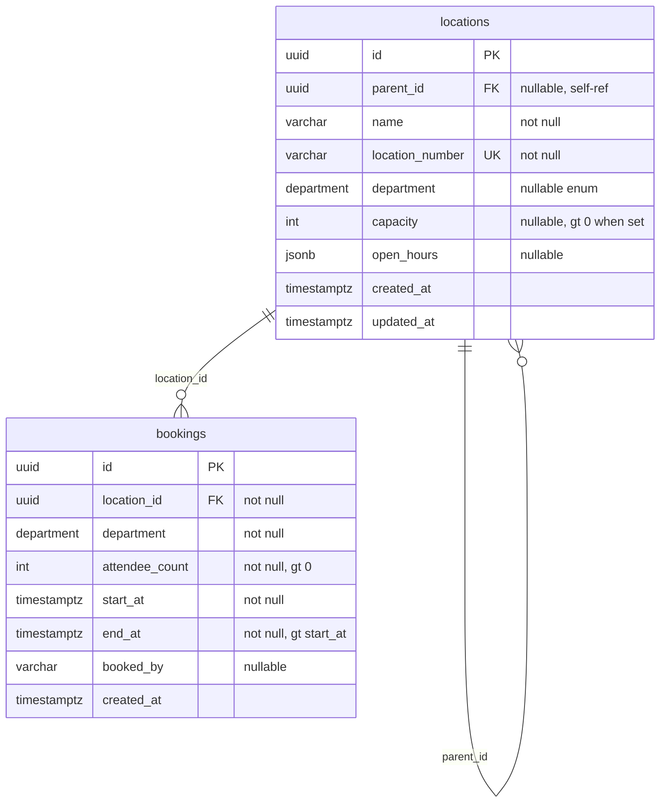

# Database Design — Location Booking API

## ER Diagram




## Tables


### `locations`

Hierarchical tree via **adjacency list** (`parent_id`). One row per physical or logical space (building, floor, room, corridor, etc.).


| Column            | Type           | Constraints                        | Notes                                 |
| ----------------- | -------------- | ---------------------------------- | ------------------------------------- |
| `id`              | `uuid`         | PK, default `gen_random_uuid()`    | Surrogate key                         |
| `parent_id`       | `uuid`         | FK → `locations(id)`, nullable     | `NULL` = root (building)              |
| `name`            | `varchar(255)` | NOT NULL                           | Display name                          |
| `location_number` | `varchar(64)`  | NOT NULL, UNIQUE                   | Business key, e.g. `A-01-01`          |
| `department`      | `department`   | nullable                           | Required for bookable rooms           |
| `capacity`        | `int`          | nullable, `CHK_locations_capacity` | Max attendees; must be `> 0` when set |
| `open_hours`      | `jsonb`        | nullable                           | See schema below                      |
| `created_at`      | `timestamptz`  | NOT NULL, default `now()`          |                                       |
| `updated_at`      | `timestamptz`  | NOT NULL, default `now()`          |                                       |


**Indexes**

```sql
CREATE UNIQUE INDEX idx_locations_location_number ON locations (location_number);
CREATE INDEX idx_locations_parent_id ON locations (parent_id);
```

**Bookability (application):** `department`, `capacity`, and `open_hours` must all be set. Enforced in `src/locations/utils/is-bookable.util.ts`.

#### `open_hours` JSONB schema

```json
{
  "type": "RECURRING",
  "days": [1, 2, 3, 4, 5],
  "startTime": "09:00",
  "endTime": "18:00"
}
```


| Field       | Type   | Required       | Description                  |
| ----------- | ------ | -------------- | ---------------------------- |
| `type`      | string | yes            | `ALWAYS_OPEN` or `RECURRING` |
| `days`      | int[]  | if RECURRING   | ISO weekday 1=Mon … 7=Sun    |
| `startTime` | string | if times apply | `HH:mm` 24h local            |
| `endTime`   | string | if times apply | `HH:mm` 24h local            |


### `bookings`


| Column           | Type           | Constraints                             | Notes                      |
| ---------------- | -------------- | --------------------------------------- | -------------------------- |
| `id`             | `uuid`         | PK                                      |                            |
| `location_id`    | `uuid`         | FK → `locations(id)`, NOT NULL          | Target room                |
| `department`     | `department`   | NOT NULL                                | Must match room department |
| `attendee_count` | `int`          | NOT NULL, `CHK_bookings_attendee_count` | Must be `> 0`              |
| `start_at`       | `timestamptz`  | NOT NULL                                | Stored in UTC              |
| `end_at`         | `timestamptz`  | NOT NULL, `CHK_bookings_time_range`     | Must be `> start_at`       |
| `booked_by`      | `varchar(255)` | nullable                                | Audit label only           |
| `created_at`     | `timestamptz`  | NOT NULL, default `now()`               |                            |


**Indexes**

```sql
CREATE INDEX idx_bookings_location_id ON bookings (location_id);
CREATE INDEX idx_bookings_time_range ON bookings (location_id, start_at, end_at);
```

**Overlap prevention (application):** inside a transaction, lock the location row (`SELECT … FOR UPDATE`), then check for an existing booking where `start_at < new.endAt AND end_at > new.startAt` (half-open interval). See `BookingsService.create()`.

## Migrations and seed

- Schema: `src/database/migrations/1782489600000-InitialSchema.ts` — enum, tables, indexes, CHECK constraints (`CHK_locations_capacity`, `CHK_bookings_attendee_count`, `CHK_bookings_time_range`). FKs use `ON DELETE RESTRICT`.
- `synchronize: false` in all environments; apply with `npm run migration:run` (see [README.md](../README.md)).
- Sample tree (15 nodes): `npm run seed` → `src/database/seed/assignment-locations.data.ts` (idempotent).

