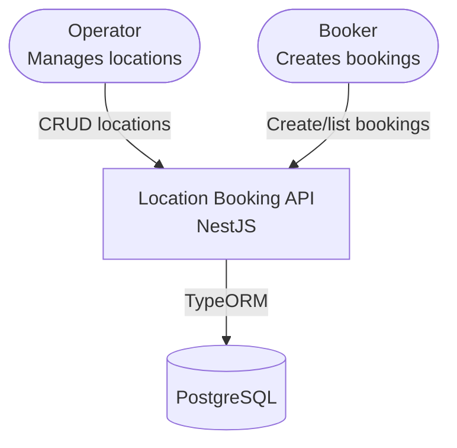
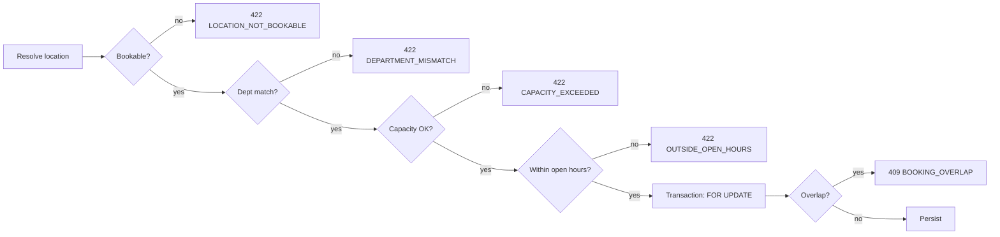

# System Design — Location Booking API

## Overview

REST API that models a **hierarchical location tree** and accepts **room bookings** validated against department, capacity, and open-hour rules. Stack: **NestJS + TypeORM + PostgreSQL**.




Schema details: `[database-design.md](database-design.md)`. Run and test: `[README.md](../README.md)`.

## Module Layout


| Module    | Path             | Responsibility                               |
| --------- | ---------------- | -------------------------------------------- |
| Locations | `src/locations/` | CRUD, tree, bookability, open-hours mapping  |
| Bookings  | `src/bookings/`  | Create + query bookings, validation pipeline |
| Health    | `src/health/`    | Liveness and database connectivity           |
| Common    | `src/common/`    | Exception filter, enums, shared utilities    |
| Database  | `src/database/`  | Migrations, seed script, TypeORM data source |


Controllers delegate to services only. `BookingsService` resolves locations via `LocationsService` — never `LocationRepository` directly.

## Locations


| Responsibility | Detail                                                                           |
| -------------- | -------------------------------------------------------------------------------- |
| CRUD           | Create under parent; read by id or `locationNumber`; partial update; safe delete |
| Tree           | `GET /locations/tree` — adjacency list (`parentId`), assembled in memory O(n)    |
| Bookability    | `isBookable` when `department`, `capacity`, and `openHours` are all set          |


**Flows**

1. **Create** — parent must exist; unique `locationNumber` (409 `LOCATION_NUMBER_EXISTS`).
2. **Update** — name, department, capacity, open hours. Existing bookings are **not** re-validated.
3. **Delete** — 409 if node has children or bookings; 204 on success.


## Bookings

**Validation pipeline** (order enforced in `BookingsService.create()`):




1. Resolve location via `LocationsService.findById`.
2. Department match — request `department` must equal room department (no auth layer).
3. Capacity — `attendeeCount` ≤ room capacity.
4. Open hours — Luxon evaluation in `APP_TIMEZONE` (default `Asia/Singapore`).
5. Overlap check inside a transaction: `SELECT … FOR UPDATE` on the location row, then query existing bookings.

Overlap uses **half-open** intervals `[start, end)`: conflict when `existing.start < new.end AND existing.end > new.start`.

## API Surface


### Locations


| Method   | Path                                   | Status | Description                       |
| -------- | -------------------------------------- | ------ | --------------------------------- |
| `POST`   | `/locations`                           | 201    | Create node                       |
| `GET`    | `/locations`                           | 200    | Flat list (`?parentId=` optional) |
| `GET`    | `/locations/tree`                      | 200    | Nested tree                       |
| `GET`    | `/locations/by-number/:locationNumber` | 200    | Lookup by business key            |
| `GET`    | `/locations/:id`                       | 200    | Single node                       |
| `PATCH`  | `/locations/:id`                       | 200    | Update mutable fields             |
| `DELETE` | `/locations/:id`                       | 204    | Delete when no children/bookings  |


### Bookings


| Method | Path            | Status | Description                             |
| ------ | --------------- | ------ | --------------------------------------- |
| `POST` | `/bookings`     | 201    | Create booking                          |
| `GET`  | `/bookings/:id` | 200    | Get by UUID                             |
| `GET`  | `/bookings`     | 200    | List (`?locationId=`, `?from=`, `?to=`) |


List filters use overlap semantics: `from` → `end_at > from`; `to` → `start_at < to`. Results ordered by `start_at ASC`.

### Health


| Method | Path      | Response                                        |
| ------ | --------- | ----------------------------------------------- |
| `GET`  | `/health` | `{ "status": "ok", "database": "up" | "down" }` |


### Response shapes

All JSON uses **camelCase**.

```json
// Location
{
  "id": "uuid",
  "parentId": "uuid-or-null",
  "name": "Meeting Room 1",
  "locationNumber": "A-01-01",
  "department": "EFM",
  "capacity": 10,
  "openHours": { "type": "RECURRING", "days": [1,2,3,4,5], "startTime": "09:00", "endTime": "18:00" },
  "isBookable": true
}

// Booking
{
  "id": "uuid",
  "locationId": "uuid",
  "department": "EFM",
  "attendeeCount": 8,
  "startAt": "2026-06-30T02:00:00.000Z",
  "endAt": "2026-06-30T03:00:00.000Z",
  "bookedBy": "team-alpha"
}
```

Tree nodes add nested `children: []`.

### Error codes


| Code                     | HTTP | When                                       |
| ------------------------ | ---- | ------------------------------------------ |
| `VALIDATION_ERROR`       | 400  | DTO validation failure                     |
| `LOCATION_NOT_FOUND`     | 404  | Unknown id or `locationNumber`             |
| `BOOKING_NOT_FOUND`      | 404  | Unknown booking id                         |
| `LOCATION_NUMBER_EXISTS` | 409  | Duplicate `locationNumber`                 |
| `BOOKING_OVERLAP`        | 409  | Overlapping interval on same room          |
| `LOCATION_HAS_CHILDREN`  | 409  | Delete blocked — has children              |
| `LOCATION_HAS_BOOKINGS`  | 409  | Delete blocked — has bookings              |
| `LOCATION_NOT_BOOKABLE`  | 422  | Missing bookable fields or structural node |
| `DEPARTMENT_MISMATCH`    | 422  | Request dept ≠ room dept                   |
| `CAPACITY_EXCEEDED`      | 422  | `attendeeCount > capacity`                 |
| `OUTSIDE_OPEN_HOURS`     | 422  | Outside allowed days/times                 |


## Open Hours

**API input** (`POST` / `PATCH` locations):

1. Structured JSON — `{ "type": "ALWAYS_OPEN" }` or `{ "type": "RECURRING", "days": [...], "startTime": "09:00", "endTime": "18:00" }`
2. Label — `{ "label": "Mon–Fri 9AM–6PM" }` parsed at the boundary, stored as structured JSONB


| Assignment label | Stored form                    |
| ---------------- | ------------------------------ |
| Mon–Fri 9AM–6PM  | `days: [1–5]`, `09:00`–`18:00` |
| Mon–Sat 9AM–6PM  | `days: [1–6]`                  |
| Mon–Sun 9AM–6PM  | `days: [1–7]`                  |
| Always open      | `{ type: "ALWAYS_OPEN" }`      |


`days` use ISO weekday (1 = Mon … 7 = Sun). Timestamps stored as UTC (`timestamptz`); evaluation uses `APP_TIMEZONE`.

## Key Design Decisions


| Decision                         | Rationale                                                                |
| -------------------------------- | ------------------------------------------------------------------------ |
| Adjacency-list tree              | Simple CRUD + in-memory tree build; fits assignment scale                |
| Bookability predicate            | Room bookable only when department, capacity, and open hours are all set |
| Ordered validation pipeline      | Fail fast on cheap checks before DB lock and overlap query               |
| Row lock + overlap query         | Prevents double booking under concurrent requests                        |
| Safe delete                      | Block delete when children or bookings exist — no cascade                |
| Inline `department` on booking   | No auth scope; optional `bookedBy` for audit only                        |
| Non-retroactive location updates | Config changes apply to new bookings only; existing ones stay valid      |
| Migrations only                  | `synchronize: false`; schema via TypeORM CLI                             |


## Demo Flow

After `npm run seed` (curl examples in [README.md](../README.md)):

1. `GET /locations/tree` — hierarchy with `isBookable`
2. `GET /locations/by-number/A-01-01` — bookable EFM room
3. `POST /bookings` — valid weekday slot → 201
4. Reject cases: wrong department (422), over capacity (422), weekend (422), overlap (409)

